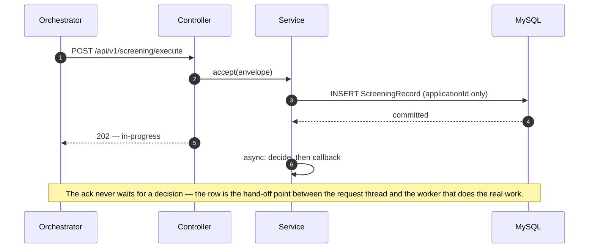
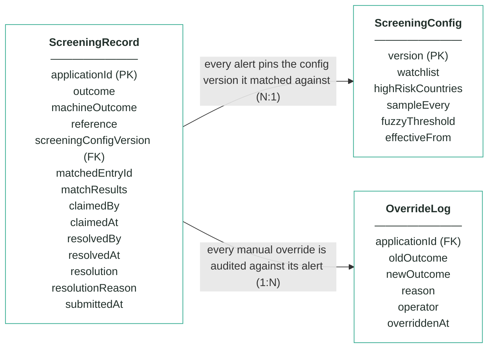
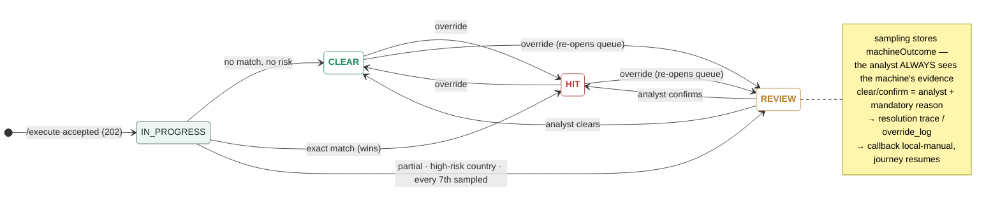

# Module 4 · Fraud & AML Screening — UC 00 · Process Application

> AI implementation brief, generated from the v5 spec (`spec/.../use-cases/`). Source of truth is the spec; regenerate, don't hand-edit.

## Context

- Module: 4 · Fraud & AML Screening · category Rule · domain `screening` · command `screen-applicant` · outcomes: CLEAR, REVIEW, HIT
- Use case: 00 · Process Application · track B · prerequisite: none (foundation) · build shape: API→DB · primary screen: — feeds every screen (row visible on the board)
- Data effect: one INSERT + 202 ack
- Platform rules (non-negotiable): the orchestrator is the only caller; the whole application arrives in the envelope (plus the v5 `outputs` block, Option A); steps are independent and re-orderable; the payload is NEVER stored — only `applicationId`; every module ships `GET /cases/{id}/applicant` proxying the orchestrator; big lists are empty by default and capped at 10 rows (≤10 hydration calls); ALL APIs are idempotent — same request twice, same result once; every endpoint appears in the service's OpenAPI 3.0 (Swagger) spec.

## Story

As the orchestrator I need every execute request acknowledged immediately and recorded durably, so the journey can advance and every other use case has a row to work on.

## Contract

```
POST /api/v1/screening/execute
{ applicationId, correlationId,
  command: "screen-applicant",
  application: { … }, outputs: { … } }
→ 202 Accepted
{ "status": "in-progress",
  "applicationId": "app-1234",
  "command": "screen-applicant" }
```

## Acceptance criteria

1. POST /api/v1/screening/execute with a valid envelope → 202 Accepted immediately — no rule or provider work happens on the request thread; body carries status "in-progress", the applicationId and the command.
2. Before the 202 is sent, exactly ONE ScreeningRecord row exists, keyed by applicationId, in an in-progress state — a crash right after the ack loses nothing.  ⟵ **checkpoint — exact value**
3. Only the applicationId is persisted from the envelope — zero payload columns; the application object is handed to the off-thread worker, never stored.
4. Repeated /execute for the same applicationId → 202 again, still one row, no re-processing; once decided, the callback replays the stored outcome.
5. A malformed envelope (missing applicationId or command) → 400 with a JSON error body, and nothing is stored.
6. The off-thread decision starts only after the row is committed — everything in this module triggers from this row.
7. The new row is immediately visible to the search and case endpoints as an in-progress case.

## Expected data changes

- **INSERT one ScreeningRecord row** keyed by applicationId — the ONLY applicant data ever stored.
- The row starts in-progress; every later use case UPDATEs or reads this same row.
- Idempotency = the unique key on applicationId; the trigger point = the commit.

## The Application entity — every field that arrives in the API

> The whole Application object is delivered in the envelope on every call. Fields this module reads are marked ●. The payload is NEVER stored — only `applicationId`.

| field | example | meaning |
|---|---|---|
| ● applicationId | app-1234 | journey key — every record this module stores is keyed by it |
| channel | MOBILE_APP | where the application was made — module 1's business; candidate 11 (velocity) would count per channel |
| submittedAt | 2026-07-21T21:40:00Z | when the customer submitted — timestamps always UTC; candidate 11's velocity window reads it |
| ● applicant.fullName | Maria Nowak | THE screening input: normalised (lower case, accents and punctuation stripped) then compared to every watchlist entry |
| ● applicant.dateOfBirth | 1996-04-11 | the disambiguator — names collide constantly, name+DOB almost never; exact match needs both |
| applicant.email / mobile | maria@…  +4477… | candidate 12's input (contact reuse across applications) — no locked rule reads them |
| applicant.nationality | PL | module 3 cross-checks the identity document — residence, not passport, drives jurisdiction risk here |
| ● applicant.countryOfResidence | GB | rule 3's whole input: on the high-risk list → REVIEW, even with no name match |
| applicant.taxResidencies | ["GB"] | module 2's policy fact — screening reads where they LIVE, not where they are taxed |
| applicant.currentAddress | 42 Hanbury St, E1 5JP | module 8 posts the card here — screening ignores it |
| identityDocument.* | PASSPORT · ZS1234567 | module 3 sends it to the identity provider — not a screening input |
| employment.status / employerName / months | PERMANENT · 11 | employerName is candidate 13's input (employer verification, stretch) — no locked rule reads it |
| finances.annualIncome | 34000 | module 5 decides the limit from it — screening has no opinion on money |
| finances.monthlyHousingCost / existingCreditCommitments | 1000 · 180 | module 5's DTI calculation — ignored here |
| product.productCode | CREDIT_CARD_REWARDS | module 1 checks it is on sale — screening screens the person, not the product |
| product.requestedCreditLimit | 3000 | module 5 caps against it — ignored here |
| delivery.useCurrentAddress / address | true · null | module 8's delivery decision — ignored here |
| consents.termsAccepted | true | module 1 enforces it, module 6 re-reads it — not a screening input |
| consents.paperless / marketingConsent | true · false | statement + marketing preferences — nothing to screen |
| outputs  (v5 · Option A) | { } | step results accumulated by the orchestrator as the saga advances — approvedLimit/APR after step 5, agreementId after 6. Nothing screening needs: this module never reads it |

_Ground rules: unknown fields are ignored on the way in and never emitted on the way out · countries ISO alpha-2 uppercase · dates YYYY-MM-DD · money = integer GBP · optional = null, never "" or 0._

## Diagrams

> Rendered images first (for PDF/preview); the mermaid source is collapsed underneath for machine consumption.

### Sequence — this use case


<details><summary>mermaid source</summary>



</details>

### Entity model (suggested — the shape to beat)


**ScreeningRecord — one row per decision; applicationId is the only applicant identifier**

| field | type | key | meaning |
|---|---|---|---|
| applicationId | string | PK | the journey key from the envelope — the ONLY applicant-related column in this schema |
| outcome | enum |  | the final answer: CLEAR, REVIEW or HIT — starts equal to machineOutcome; only an analyst decision or override can change it |
| machineOutcome | enum |  | what rules 1–3 computed before sampling — kept so the analyst always sees the machine's own answer |
| reference | string |  | human-facing alert reference shown on every screen and in the callback, e.g. scr-000342 |
| screeningConfigVersion | int | FK | the ScreeningConfig version (watchlist + country list) this alert was matched against — pinned forever, never re-pointed |
| matchedEntryId | string, nullable |  | the watchlist entry an exact match hit, e.g. WL-001; null when no entry matched |
| matchResults | JSON |  | the evidence: normalisedName as actually compared, candidates[] with matched fields and verdict for EVERY entry considered (near-misses included), countryRisk, sampling |
| claimedBy | string, nullable |  | analyst queue — the analyst who claimed the alert; null when unclaimed or released |
| claimedAt | timestamp, nullable |  | analyst queue — when the alert was claimed |
| resolvedBy | string, nullable |  | who made the human decision (queue clear/confirm or override) |
| resolvedAt | timestamp, nullable |  | when the human decision was made |
| resolution | enum, nullable |  | which exit the analyst took: CLEARED or CONFIRMED; null while the alert is open |
| resolutionReason | string, nullable |  | the mandatory reason recorded with every analyst decision |
| submittedAt | timestamp |  | when the orchestrator submitted the case |

**ScreeningConfig — insert-only, versioned lists; the current version is the highest**

| field | type | key | meaning |
|---|---|---|---|
| version | int | PK | one new row per change — rows are inserted, never updated; current = MAX(version) |
| watchlist | JSON |  | array of {entryId, fullName, dateOfBirth, listType}; seeded WL-001 Marek Nowak 1961-04-19 · WL-002 Viktor Orlov 1975-08-22 · WL-003 Amara Diallo 1969-02-10, all SANCTIONS |
| highRiskCountries | JSON |  | ISO alpha-2 codes whose residents park REVIEW under rule 3 (seeded [IR, KP, SY, BY]) |
| sampleEvery | int |  | rule 4's X — every Xth first-time decision parks for an analyst, whatever the rules said (seeded 7) |
| fuzzyThreshold | int, nullable |  | the fuzzy-distance upgrade's dial — no locked rule reads it; locked matching is exact-after-normalisation |
| effectiveFrom | timestamp |  | when this version became the current one |

**OverrideLog — audit trail; one row per manual override, none ever deleted**

| field | type | key | meaning |
|---|---|---|---|
| applicationId | string | FK | the alert that was overridden |
| oldOutcome | enum |  | the outcome before the override |
| newOutcome | enum |  | the outcome after the override |
| reason | string |  | the mandatory justification typed by the operator |
| operator | string |  | who performed the override |
| overriddenAt | timestamp |  | when it happened |

Relationships: ScreeningRecord N:1 ScreeningConfig — every alert pins the config version it matched against · ScreeningRecord 1:N OverrideLog — every manual override is audited against its alert

<details><summary>mermaid source (generated from the spec tables)</summary>



</details>

### State transitions — the case record


<details><summary>mermaid source</summary>



</details>

## Out of scope

Deciding anything (that is the engine use case, which runs off-thread AFTER this row exists); the callback content.

## Build notes

Partially implemented by the template — the 202-then-callback controller is given. Your work: the durable ScreeningRecord row, idempotency by applicationId, and the async hand-off. EVERY other use case depends on this one: no row, no review, no queue, no override, no report.

## Tests

Slice test: 202 shape + row inserted before the ack returns; repeated /execute → one row; malformed envelope → 400 and nothing stored.

## Sequence caption

The ack never waits for a decision — the row is the hand-off point between the request thread and the worker that does the real work.

## Definition of done

All acceptance criteria verified against the running app · `./mvnw test` green · teammate-reviewed PR merged to main · fresh clone builds green · endpoint idempotent + present in the OpenAPI 3.0 (Swagger) spec · demoable from the UI.
