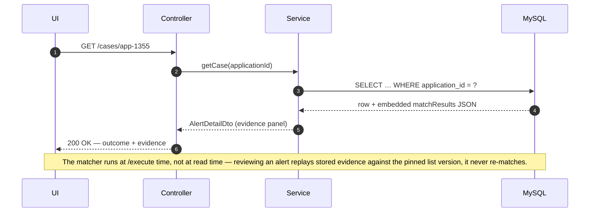
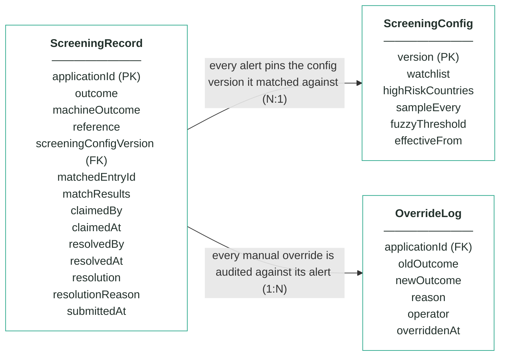
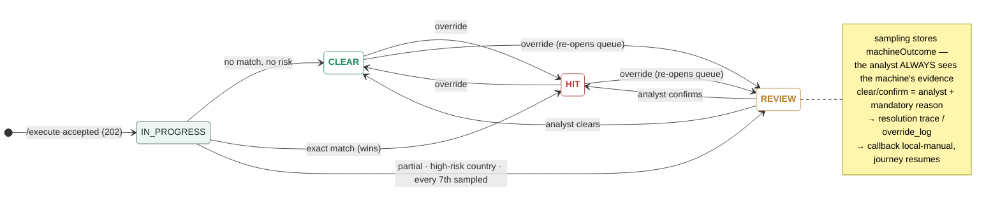

# Module 4 · Fraud & AML Screening — UC 02 · Review Alert

> AI implementation brief, generated from the v5 spec (`spec/.../use-cases/`). Source of truth is the spec; regenerate, don't hand-edit.

## Context

- Module: 4 · Fraud & AML Screening · category Rule · domain `screening` · command `screen-applicant` · outcomes: CLEAR, REVIEW, HIT
- Use case: 02 · Review Alert · track B · prerequisite: after 00 + 05 — the matcher needs seeded watchlist entries · build shape: API+FE (engine: DB) · primary screen: Alert Detail
- Data effect: read-only (row written earlier)
- Platform rules (non-negotiable): the orchestrator is the only caller; the whole application arrives in the envelope (plus the v5 `outputs` block, Option A); steps are independent and re-orderable; the payload is NEVER stored — only `applicationId`; every module ships `GET /cases/{id}/applicant` proxying the orchestrator; big lists are empty by default and capped at 10 rows (≤10 hydration calls); ALL APIs are idempotent — same request twice, same result once; every endpoint appears in the service's OpenAPI 3.0 (Swagger) spec.

## Story

As a bank employee I want to open a screening alert and see which entry it matched and why — the normalised name, every candidate considered, the fields that matched — not just a verdict.

## Contract

```
GET /cases/{applicationId} →
{"outcome":"HIT","machineOutcome":"HIT",
 "reference":"scr-000355",
 "screeningConfigVersion":1,
 "matchResults":{"normalisedName":"marek nowak",
  "candidates":[{"entryId":"WL-001",
    "matchedFields":["fullName","dateOfBirth"],
    "rule":"exact","verdict":"hit"}],
  "countryRisk":{"passed":true},
  "sampling":{"sampled":false}}}
```

## Acceptance criteria

1. GET /cases/{applicationId} → 200 + outcome, machineOutcome, reference, screeningConfigVersion, matchResults (normalisedName, candidates[], countryRisk, sampling).
2. Maria Nowak (app-1234) → CLEAR with SCR_NO_MATCH; candidates[] records the WL-001 near-miss with matchedFields ["surname"] and verdict no-match — a surname collision alone alerts nobody.  ⟵ **checkpoint — exact value**
3. Marek Nowak (app-1355) → HIT with SCR_EXACT_MATCH against WL-001, matchedFields ["fullName","dateOfBirth"].  ⟵ **checkpoint — exact value**
4. An applicant named Amara Diallo born 1988-06-02 (app-1372) → REVIEW with SCR_PARTIAL_MATCH against WL-003 — full name matched, DOB did not.  ⟵ **checkpoint — exact value**
5. Names differing only in case, accents or punctuation compare EQUAL — "MAREK NOWAK", "Marek Nowák" and "marek nowak" all hit WL-001.
6. Elena Petrova (app-1360), resident BY, no name match → REVIEW with SCR_HIGH_RISK_COUNTRY; an applicant with BOTH an exact match and a risky residence stays HIT — exact wins.
7. The fixture's 14th screening decision (app-1291) → REVIEW with SCR_SAMPLED_FOR_REVIEW, machineOutcome CLEAR, sampling.position = 14.  ⟵ **checkpoint — exact value**
8. Multiple REVIEW causes are ALL reported — a partial match in a risky country carries both codes.
9. Repeated /execute for the same applicationId → still one row, no re-match, callback replays the stored outcome; unknown applicationId → 404 with a JSON error body.

## Expected data changes

- **This GET changes nothing.** The row it reads was written once, off-thread, by /execute.
- On /execute: INSERT screening_record (outcome, machineOutcome, matchResults JSON, screeningConfigVersion pinned).
- Unique key on application_id is what makes the idempotency AC provable.

## Diagrams

> Rendered images first (for PDF/preview); the mermaid source is collapsed underneath for machine consumption.

### Sequence — this use case


<details><summary>mermaid source</summary>



</details>

### Entity model (suggested — the shape to beat)


**ScreeningRecord — one row per decision; applicationId is the only applicant identifier**

| field | type | key | meaning |
|---|---|---|---|
| applicationId | string | PK | the journey key from the envelope — the ONLY applicant-related column in this schema |
| outcome | enum |  | the final answer: CLEAR, REVIEW or HIT — starts equal to machineOutcome; only an analyst decision or override can change it |
| machineOutcome | enum |  | what rules 1–3 computed before sampling — kept so the analyst always sees the machine's own answer |
| reference | string |  | human-facing alert reference shown on every screen and in the callback, e.g. scr-000342 |
| screeningConfigVersion | int | FK | the ScreeningConfig version (watchlist + country list) this alert was matched against — pinned forever, never re-pointed |
| matchedEntryId | string, nullable |  | the watchlist entry an exact match hit, e.g. WL-001; null when no entry matched |
| matchResults | JSON |  | the evidence: normalisedName as actually compared, candidates[] with matched fields and verdict for EVERY entry considered (near-misses included), countryRisk, sampling |
| claimedBy | string, nullable |  | analyst queue — the analyst who claimed the alert; null when unclaimed or released |
| claimedAt | timestamp, nullable |  | analyst queue — when the alert was claimed |
| resolvedBy | string, nullable |  | who made the human decision (queue clear/confirm or override) |
| resolvedAt | timestamp, nullable |  | when the human decision was made |
| resolution | enum, nullable |  | which exit the analyst took: CLEARED or CONFIRMED; null while the alert is open |
| resolutionReason | string, nullable |  | the mandatory reason recorded with every analyst decision |
| submittedAt | timestamp |  | when the orchestrator submitted the case |

**ScreeningConfig — insert-only, versioned lists; the current version is the highest**

| field | type | key | meaning |
|---|---|---|---|
| version | int | PK | one new row per change — rows are inserted, never updated; current = MAX(version) |
| watchlist | JSON |  | array of {entryId, fullName, dateOfBirth, listType}; seeded WL-001 Marek Nowak 1961-04-19 · WL-002 Viktor Orlov 1975-08-22 · WL-003 Amara Diallo 1969-02-10, all SANCTIONS |
| highRiskCountries | JSON |  | ISO alpha-2 codes whose residents park REVIEW under rule 3 (seeded [IR, KP, SY, BY]) |
| sampleEvery | int |  | rule 4's X — every Xth first-time decision parks for an analyst, whatever the rules said (seeded 7) |
| fuzzyThreshold | int, nullable |  | the fuzzy-distance upgrade's dial — no locked rule reads it; locked matching is exact-after-normalisation |
| effectiveFrom | timestamp |  | when this version became the current one |

**OverrideLog — audit trail; one row per manual override, none ever deleted**

| field | type | key | meaning |
|---|---|---|---|
| applicationId | string | FK | the alert that was overridden |
| oldOutcome | enum |  | the outcome before the override |
| newOutcome | enum |  | the outcome after the override |
| reason | string |  | the mandatory justification typed by the operator |
| operator | string |  | who performed the override |
| overriddenAt | timestamp |  | when it happened |

Relationships: ScreeningRecord N:1 ScreeningConfig — every alert pins the config version it matched against · ScreeningRecord 1:N OverrideLog — every manual override is audited against its alert

<details><summary>mermaid source (generated from the spec tables)</summary>



</details>

### State transitions — the case record


<details><summary>mermaid source</summary>



</details>

## Out of scope

Editing an alert (records are immutable — analyst decision is UC 04, override is UC 08); the /execute wiring itself (template gives it).

## Build notes

The matcher is plain functions over the application object + the current ScreeningConfig — build and unit-test it before any Spring wiring, normalisation first. Precedence: sampling parks everything → REVIEW; else exact → HIT; else any partial/country evidence → REVIEW with ALL of it; else CLEAR. Candidates[] keeps every entry considered — verdicts hit / partial / no-match — so near-misses are evidence too.

## Tests

Matcher: table-driven unit tests per rule + normalisation (case, accents, punctuation) + precedence (exact-beats-country, sampling-beats-exact-parking); slice test for the GET.

## Sequence caption

The matcher runs at /execute time, not at read time — reviewing an alert replays stored evidence against the pinned list version, it never re-matches.

## Definition of done

All acceptance criteria verified against the running app · `./mvnw test` green · teammate-reviewed PR merged to main · fresh clone builds green · endpoint idempotent + present in the OpenAPI 3.0 (Swagger) spec · demoable from the UI.
