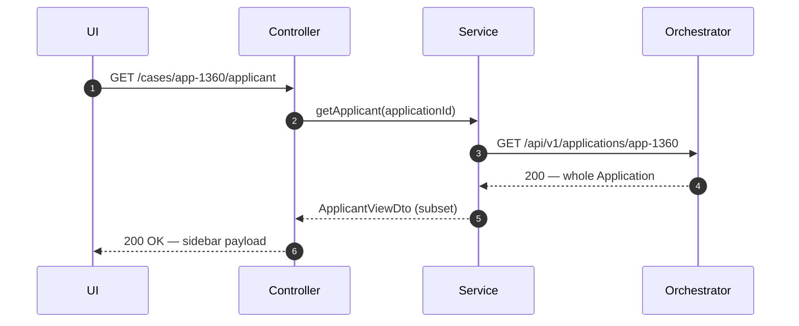
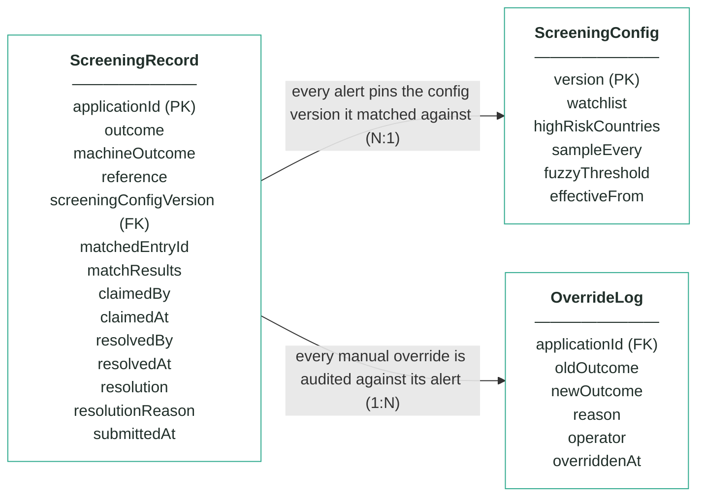
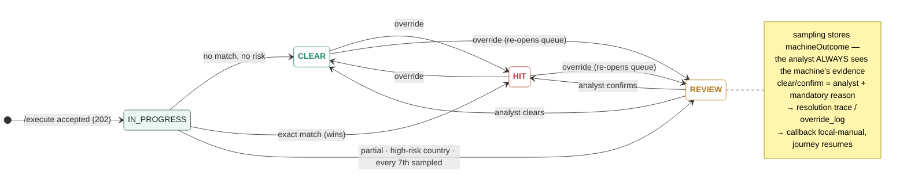

# Module 4 · Fraud & AML Screening — UC 03 · View Applicant

> AI implementation brief, generated from the v5 spec (`spec/.../use-cases/`). Source of truth is the spec; regenerate, don't hand-edit.

## Context

- Module: 4 · Fraud & AML Screening · category Rule · domain `screening` · command `screen-applicant` · outcomes: CLEAR, REVIEW, HIT
- Use case: 03 · View Applicant · track D · prerequisite: screen shell from 02 · build shape: API+FE · primary screen: Alert Detail sidebar
- Data effect: none — by design
- Platform rules (non-negotiable): the orchestrator is the only caller; the whole application arrives in the envelope (plus the v5 `outputs` block, Option A); steps are independent and re-orderable; the payload is NEVER stored — only `applicationId`; every module ships `GET /cases/{id}/applicant` proxying the orchestrator; big lists are empty by default and capped at 10 rows (≤10 hydration calls); ALL APIs are idempotent — same request twice, same result once; every endpoint appears in the service's OpenAPI 3.0 (Swagger) spec.

## Story

As a bank employee I want to see who an alert is about without leaving the record — and without this module ever copying applicant data.

## Contract

```
GET /cases/{id}/applicant →  (proxy)
GET {orchestratorUrl}/api/v1/
        applications/{applicationId}
→ { …whole Application object… }
```

## Acceptance criteria

1. The Alert Detail sidebar renders fullName, dateOfBirth, countryOfResidence, nationality and channel — fetched live.
2. For app-1360 the sidebar shows Elena Petrova · countryOfResidence BY — the jurisdiction evidence sits right beside the rule card that fired.  ⟵ **checkpoint — exact value**
3. Nothing from the response is persisted — restart the module, the sidebar still works, the schema still holds zero applicant columns.
4. Orchestrator unreachable → the sidebar shows a retryable error state; the alert and its evidence still render from local data.
5. The proxy passes applicationId through untouched — no id mapping tables.

## Expected data changes

- **Zero writes, zero copies.** The whole point: one copy of the truth, owned by the orchestrator.
- MySQL is not even touched on this path.
- If the orchestrator is down the module stays healthy — only the sidebar degrades.

## Diagrams

> Rendered images first (for PDF/preview); the mermaid source is collapsed underneath for machine consumption.

### Sequence — this use case


<details><summary>mermaid source</summary>



</details>

### Entity model (suggested — the shape to beat)


**ScreeningRecord — one row per decision; applicationId is the only applicant identifier**

| field | type | key | meaning |
|---|---|---|---|
| applicationId | string | PK | the journey key from the envelope — the ONLY applicant-related column in this schema |
| outcome | enum |  | the final answer: CLEAR, REVIEW or HIT — starts equal to machineOutcome; only an analyst decision or override can change it |
| machineOutcome | enum |  | what rules 1–3 computed before sampling — kept so the analyst always sees the machine's own answer |
| reference | string |  | human-facing alert reference shown on every screen and in the callback, e.g. scr-000342 |
| screeningConfigVersion | int | FK | the ScreeningConfig version (watchlist + country list) this alert was matched against — pinned forever, never re-pointed |
| matchedEntryId | string, nullable |  | the watchlist entry an exact match hit, e.g. WL-001; null when no entry matched |
| matchResults | JSON |  | the evidence: normalisedName as actually compared, candidates[] with matched fields and verdict for EVERY entry considered (near-misses included), countryRisk, sampling |
| claimedBy | string, nullable |  | analyst queue — the analyst who claimed the alert; null when unclaimed or released |
| claimedAt | timestamp, nullable |  | analyst queue — when the alert was claimed |
| resolvedBy | string, nullable |  | who made the human decision (queue clear/confirm or override) |
| resolvedAt | timestamp, nullable |  | when the human decision was made |
| resolution | enum, nullable |  | which exit the analyst took: CLEARED or CONFIRMED; null while the alert is open |
| resolutionReason | string, nullable |  | the mandatory reason recorded with every analyst decision |
| submittedAt | timestamp |  | when the orchestrator submitted the case |

**ScreeningConfig — insert-only, versioned lists; the current version is the highest**

| field | type | key | meaning |
|---|---|---|---|
| version | int | PK | one new row per change — rows are inserted, never updated; current = MAX(version) |
| watchlist | JSON |  | array of {entryId, fullName, dateOfBirth, listType}; seeded WL-001 Marek Nowak 1961-04-19 · WL-002 Viktor Orlov 1975-08-22 · WL-003 Amara Diallo 1969-02-10, all SANCTIONS |
| highRiskCountries | JSON |  | ISO alpha-2 codes whose residents park REVIEW under rule 3 (seeded [IR, KP, SY, BY]) |
| sampleEvery | int |  | rule 4's X — every Xth first-time decision parks for an analyst, whatever the rules said (seeded 7) |
| fuzzyThreshold | int, nullable |  | the fuzzy-distance upgrade's dial — no locked rule reads it; locked matching is exact-after-normalisation |
| effectiveFrom | timestamp |  | when this version became the current one |

**OverrideLog — audit trail; one row per manual override, none ever deleted**

| field | type | key | meaning |
|---|---|---|---|
| applicationId | string | FK | the alert that was overridden |
| oldOutcome | enum |  | the outcome before the override |
| newOutcome | enum |  | the outcome after the override |
| reason | string |  | the mandatory justification typed by the operator |
| operator | string |  | who performed the override |
| overriddenAt | timestamp |  | when it happened |

Relationships: ScreeningRecord N:1 ScreeningConfig — every alert pins the config version it matched against · ScreeningRecord 1:N OverrideLog — every manual override is audited against its alert

<details><summary>mermaid source (generated from the spec tables)</summary>



</details>

### State transitions — the case record


<details><summary>mermaid source</summary>



</details>

## Out of scope

Caching applicant data; storing any applicant field in this module's schema (forbidden by the contract).

## Build notes

THE standard application-fetch GET every module ships (v5 platform rule) — the same proxy hydrates the board's name column (UC 01) and the analyst queue's rows (UC 04). It goes to the orchestrator only, server-side, so the browser needs no CORS exception. The analyst reads the LIVE name right beside the normalised one the matcher used — the pair is the point.

## Tests

Service test with a mocked orchestrator client: happy path + orchestrator down → sidebar error, alert still renders.

## Definition of done

All acceptance criteria verified against the running app · `./mvnw test` green · teammate-reviewed PR merged to main · fresh clone builds green · endpoint idempotent + present in the OpenAPI 3.0 (Swagger) spec · demoable from the UI.
