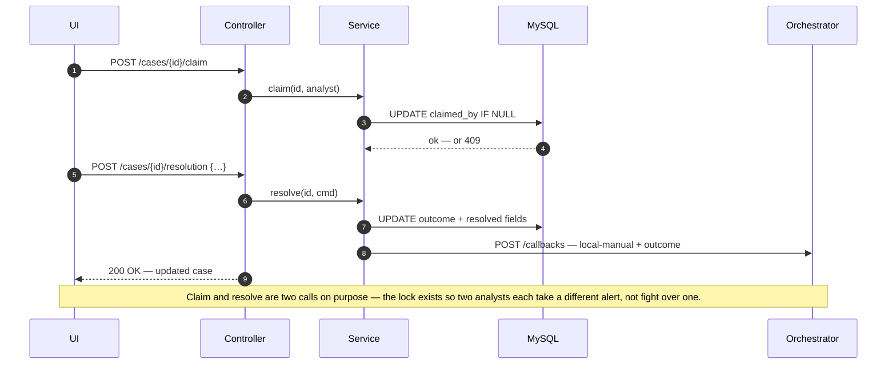
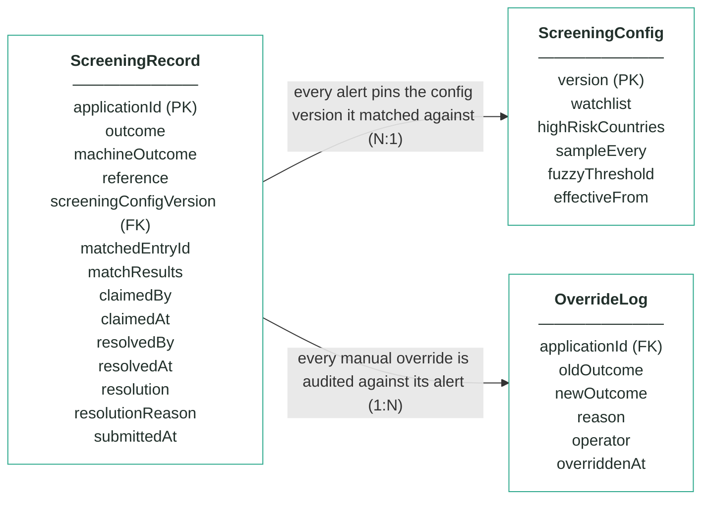
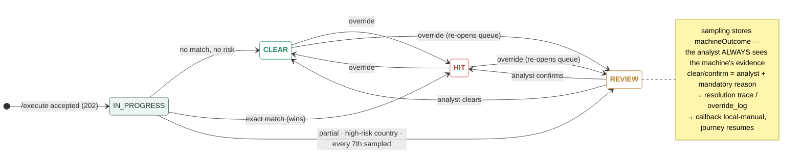

# Module 4 · Fraud & AML Screening — UC 04 · Work Analyst Queue

> AI implementation brief, generated from the v5 spec (`spec/.../use-cases/`). Source of truth is the spec; regenerate, don't hand-edit.

## Context

- Module: 4 · Fraud & AML Screening · category Rule · domain `screening` · command `screen-applicant` · outcomes: CLEAR, REVIEW, HIT
- Use case: 04 · Work Analyst Queue · track B · prerequisite: after 02 is wired · build shape: DB-write→API→FE · primary screen: Analyst Queue
- Data effect: claim + resolution writes + one callback
- Platform rules (non-negotiable): the orchestrator is the only caller; the whole application arrives in the envelope (plus the v5 `outputs` block, Option A); steps are independent and re-orderable; the payload is NEVER stored — only `applicationId`; every module ships `GET /cases/{id}/applicant` proxying the orchestrator; big lists are empty by default and capped at 10 rows (≤10 hydration calls); ALL APIs are idempotent — same request twice, same result once; every endpoint appears in the service's OpenAPI 3.0 (Swagger) spec.

## Story

As a screening analyst I want to claim an open REVIEW, weigh the machine's evidence, and either clear the alert or confirm it as a true match — with my name and reason on record forever.

## Contract

```
POST /cases/{id}/claim   {"analyst":"r.iqbal"}
POST /cases/{id}/release {"analyst":"r.iqbal"}
POST /cases/{id}/resolution
{"resolution":"CLEAR",   // or CONFIRM
 "reason":"no adverse indicators — jurisdiction only",
 "analyst":"r.iqbal"}
→ 200 + updated case
```

## Acceptance criteria

1. The queue lists open REVIEWs only, oldest first, max 10, each row showing its cause (partial / country / sampled) and claim state.
2. POST /cases/{id}/claim → 200 and locks the alert to that analyst; a second claim by another analyst → 409; release frees it.
3. The resolution panel ALWAYS shows the machine's evidence: machineOutcome, normalisedName, every candidate with matched fields, the country check, the sampling card.
4. POST /cases/{id}/resolution {resolution, reason, analyst} → 200; resolution must be CLEAR or CONFIRM; reason and analyst are mandatory → 400 without either.
5. CLEAR sets outcome CLEAR with SCR_CLEARED_BY_ANALYST; CONFIRM sets outcome HIT with SCR_CONFIRMED_BY_ANALYST — each fires ONE callback with status local-manual, and the parked journey resumes.
6. Clearing Elena Petrova (app-1360) records resolvedBy, resolvedAt and the reason; her machine REVIEW and its evidence stay visible forever.  ⟵ **checkpoint — exact value**
7. At the fixture reference time 2026-07-15T09:00Z the queue holds exactly 4 open alerts — 2 sampled, 1 partial (app-1372), 1 high-risk country.  ⟵ **checkpoint — exact value**
8. A resolved alert leaves the queue and shows the human resolution on top of the machine's evidence in Alert Detail.

## Expected data changes

- **UPDATE screening_record** SET claimed_by/claimed_at on claim; outcome + resolved_by/resolved_at/resolution/resolution_reason on resolve.
- machineOutcome and matchResults are NEVER touched — the evidence survives the decision.
- Callback status local-manual tells the orchestrator a human decided — the journey resumes (or ends, if confirmed).

## Diagrams

> Rendered images first (for PDF/preview); the mermaid source is collapsed underneath for machine consumption.

### Sequence — this use case


<details><summary>mermaid source</summary>



</details>

### Entity model (suggested — the shape to beat)


**ScreeningRecord — one row per decision; applicationId is the only applicant identifier**

| field | type | key | meaning |
|---|---|---|---|
| applicationId | string | PK | the journey key from the envelope — the ONLY applicant-related column in this schema |
| outcome | enum |  | the final answer: CLEAR, REVIEW or HIT — starts equal to machineOutcome; only an analyst decision or override can change it |
| machineOutcome | enum |  | what rules 1–3 computed before sampling — kept so the analyst always sees the machine's own answer |
| reference | string |  | human-facing alert reference shown on every screen and in the callback, e.g. scr-000342 |
| screeningConfigVersion | int | FK | the ScreeningConfig version (watchlist + country list) this alert was matched against — pinned forever, never re-pointed |
| matchedEntryId | string, nullable |  | the watchlist entry an exact match hit, e.g. WL-001; null when no entry matched |
| matchResults | JSON |  | the evidence: normalisedName as actually compared, candidates[] with matched fields and verdict for EVERY entry considered (near-misses included), countryRisk, sampling |
| claimedBy | string, nullable |  | analyst queue — the analyst who claimed the alert; null when unclaimed or released |
| claimedAt | timestamp, nullable |  | analyst queue — when the alert was claimed |
| resolvedBy | string, nullable |  | who made the human decision (queue clear/confirm or override) |
| resolvedAt | timestamp, nullable |  | when the human decision was made |
| resolution | enum, nullable |  | which exit the analyst took: CLEARED or CONFIRMED; null while the alert is open |
| resolutionReason | string, nullable |  | the mandatory reason recorded with every analyst decision |
| submittedAt | timestamp |  | when the orchestrator submitted the case |

**ScreeningConfig — insert-only, versioned lists; the current version is the highest**

| field | type | key | meaning |
|---|---|---|---|
| version | int | PK | one new row per change — rows are inserted, never updated; current = MAX(version) |
| watchlist | JSON |  | array of {entryId, fullName, dateOfBirth, listType}; seeded WL-001 Marek Nowak 1961-04-19 · WL-002 Viktor Orlov 1975-08-22 · WL-003 Amara Diallo 1969-02-10, all SANCTIONS |
| highRiskCountries | JSON |  | ISO alpha-2 codes whose residents park REVIEW under rule 3 (seeded [IR, KP, SY, BY]) |
| sampleEvery | int |  | rule 4's X — every Xth first-time decision parks for an analyst, whatever the rules said (seeded 7) |
| fuzzyThreshold | int, nullable |  | the fuzzy-distance upgrade's dial — no locked rule reads it; locked matching is exact-after-normalisation |
| effectiveFrom | timestamp |  | when this version became the current one |

**OverrideLog — audit trail; one row per manual override, none ever deleted**

| field | type | key | meaning |
|---|---|---|---|
| applicationId | string | FK | the alert that was overridden |
| oldOutcome | enum |  | the outcome before the override |
| newOutcome | enum |  | the outcome after the override |
| reason | string |  | the mandatory justification typed by the operator |
| operator | string |  | who performed the override |
| overriddenAt | timestamp |  | when it happened |

Relationships: ScreeningRecord N:1 ScreeningConfig — every alert pins the config version it matched against · ScreeningRecord 1:N OverrideLog — every manual override is audited against its alert

<details><summary>mermaid source (generated from the spec tables)</summary>



</details>

### State transitions — the case record


<details><summary>mermaid source</summary>



</details>

## Out of scope

Resolving non-REVIEW cases from here (that is UC 08 Override); claim timeouts, SLA clocks and false-positive suppression lists (stretch, not locked).

## Build notes

Queue = GET /cases?outcome=REVIEW&unclaimed-first, oldest first, max 10, each row badged with its cause (partial / country / sampled). Claim sets claimedBy/claimedAt, 409 on a second claim. Resolution: CLEAR → outcome CLEAR + SCR_CLEARED_BY_ANALYST; CONFIRM → outcome HIT + SCR_CONFIRMED_BY_ANALYST (v5). Either way ONE fresh callback, status local-manual. The evidence panel is embedded read-only — an analyst can never decide blind.

## Tests

Slice test: claim happy path, double-claim → 409, resolve without reason → 400; service test asserts exactly one local-manual callback per resolution and the right code per branch.

## Sequence caption

Claim and resolve are two calls on purpose — the lock exists so two analysts each take a different alert, not fight over one.

## Definition of done

All acceptance criteria verified against the running app · `./mvnw test` green · teammate-reviewed PR merged to main · fresh clone builds green · endpoint idempotent + present in the OpenAPI 3.0 (Swagger) spec · demoable from the UI.
