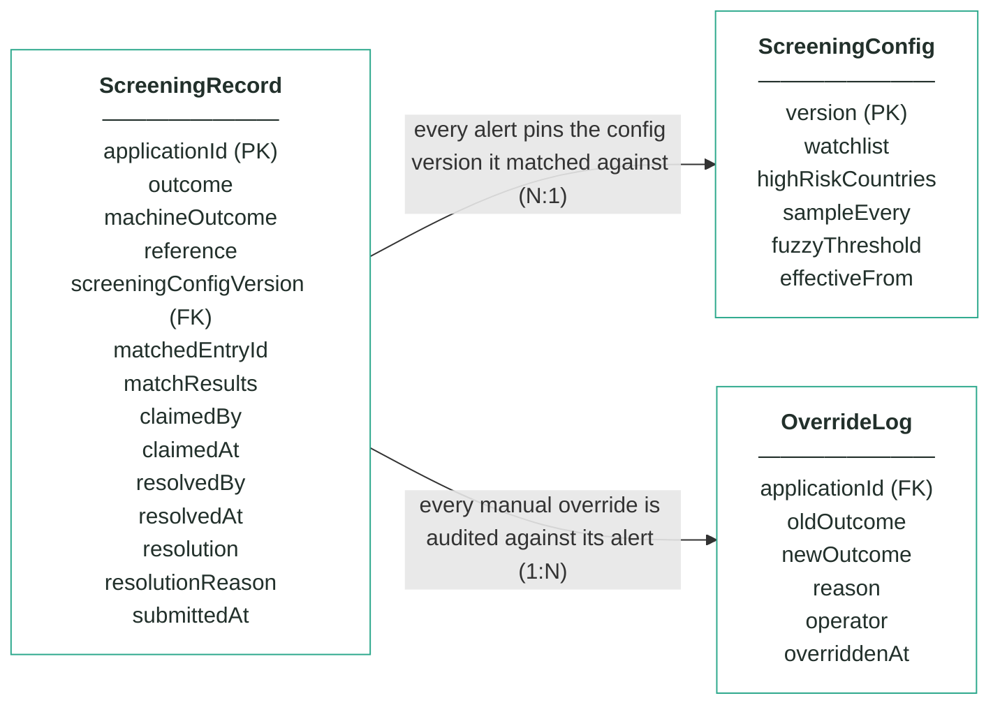
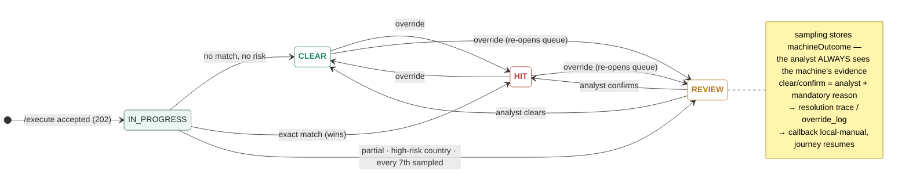

# Module 4 · Fraud & AML Screening — UC 12 · Contact info reuse (CANDIDATE)

> AI implementation brief, generated from the v5 spec (`spec/.../use-cases/`). Source of truth is the spec; regenerate, don't hand-edit.

## Context

- Module: 4 · Fraud & AML Screening · category Rule · domain `screening` · command `screen-applicant` · outcomes: CLEAR, REVIEW, HIT
- Use case: 12 · Contact info reuse · track B · prerequisite: after 11 (same hash mechanics) · build shape: engine branch over own records · primary screen: Alert Detail (reuse card)
- Data effect: config field + hashed contact columns
- Platform rules (non-negotiable): the orchestrator is the only caller; the whole application arrives in the envelope (plus the v5 `outputs` block, Option A); steps are independent and re-orderable; the payload is NEVER stored — only `applicationId`; every module ships `GET /cases/{id}/applicant` proxying the orchestrator; big lists are empty by default and capped at 10 rows (≤10 hydration calls); ALL APIs are idempotent — same request twice, same result once; every endpoint appears in the service's OpenAPI 3.0 (Swagger) spec.

## Story

Velocity catches one name applying often. This catches the opposite: many DIFFERENT names sharing one email address or one phone number — the classic synthetic-identity pattern, where the fraudster varies the person but reuses the contact details they control.

## What it adds

- The engine gains rule 6: hash the normalised email and mobile; if the same contact hash already appears on prior records under a DIFFERENT identity hash → REVIEW; matchResults gains a reuse card (which contact type, how many identities).
- ScreeningConfig gains `contactReuseThreshold` (distinct identities per contact before flagging, nullable — null disables).
- New reason code `SCR_CONTACT_REUSED` — a v5 contract addition, instructor applies it.
- Extends UC 11's hash columns with contactHash pairs — same one-way discipline, same register entry; storing a raw email or number is FORBIDDEN.

## Acceptance criteria

1. With threshold 2, a third distinct identity arriving with an already-seen email hash → REVIEW with SCR_CONTACT_REUSED; the reuse card names the contact type and the identity count.
2. The SAME person reapplying with the same email does not trip the rule — reuse means different identities, not repetition.
3. A reuse REVIEW combined with other evidence reports all codes; an exact sanctions match still wins as HIT.
4. contactReuseThreshold = null leaves the engine exactly as before — all eight UC 01–08 ACs pass unchanged.
5. No raw email or phone number appears anywhere in the schema — hashes only, documented in the decisions register.

## Diagrams

> Rendered images first (for PDF/preview); the mermaid source is collapsed underneath for machine consumption.

### Entity model (suggested — the shape to beat)

**ScreeningRecord — one row per decision; applicationId is the only applicant identifier**

| field | type | key | meaning |
|---|---|---|---|
| applicationId | string | PK | the journey key from the envelope — the ONLY applicant-related column in this schema |
| outcome | enum |  | the final answer: CLEAR, REVIEW or HIT — starts equal to machineOutcome; only an analyst decision or override can change it |
| machineOutcome | enum |  | what rules 1–3 computed before sampling — kept so the analyst always sees the machine's own answer |
| reference | string |  | human-facing alert reference shown on every screen and in the callback, e.g. scr-000342 |
| screeningConfigVersion | int | FK | the ScreeningConfig version (watchlist + country list) this alert was matched against — pinned forever, never re-pointed |
| matchedEntryId | string, nullable |  | the watchlist entry an exact match hit, e.g. WL-001; null when no entry matched |
| matchResults | JSON |  | the evidence: normalisedName as actually compared, candidates[] with matched fields and verdict for EVERY entry considered (near-misses included), countryRisk, sampling |
| claimedBy | string, nullable |  | analyst queue — the analyst who claimed the alert; null when unclaimed or released |
| claimedAt | timestamp, nullable |  | analyst queue — when the alert was claimed |
| resolvedBy | string, nullable |  | who made the human decision (queue clear/confirm or override) |
| resolvedAt | timestamp, nullable |  | when the human decision was made |
| resolution | enum, nullable |  | which exit the analyst took: CLEARED or CONFIRMED; null while the alert is open |
| resolutionReason | string, nullable |  | the mandatory reason recorded with every analyst decision |
| submittedAt | timestamp |  | when the orchestrator submitted the case |

**ScreeningConfig — insert-only, versioned lists; the current version is the highest**

| field | type | key | meaning |
|---|---|---|---|
| version | int | PK | one new row per change — rows are inserted, never updated; current = MAX(version) |
| watchlist | JSON |  | array of {entryId, fullName, dateOfBirth, listType}; seeded WL-001 Marek Nowak 1961-04-19 · WL-002 Viktor Orlov 1975-08-22 · WL-003 Amara Diallo 1969-02-10, all SANCTIONS |
| highRiskCountries | JSON |  | ISO alpha-2 codes whose residents park REVIEW under rule 3 (seeded [IR, KP, SY, BY]) |
| sampleEvery | int |  | rule 4's X — every Xth first-time decision parks for an analyst, whatever the rules said (seeded 7) |
| fuzzyThreshold | int, nullable |  | the fuzzy-distance upgrade's dial — no locked rule reads it; locked matching is exact-after-normalisation |
| effectiveFrom | timestamp |  | when this version became the current one |

**OverrideLog — audit trail; one row per manual override, none ever deleted**

| field | type | key | meaning |
|---|---|---|---|
| applicationId | string | FK | the alert that was overridden |
| oldOutcome | enum |  | the outcome before the override |
| newOutcome | enum |  | the outcome after the override |
| reason | string |  | the mandatory justification typed by the operator |
| operator | string |  | who performed the override |
| overriddenAt | timestamp |  | when it happened |

Relationships: ScreeningRecord N:1 ScreeningConfig — every alert pins the config version it matched against · ScreeningRecord 1:N OverrideLog — every manual override is audited against its alert

mermaid source (generated from the spec tables)

### State transitions — the case record

mermaid source

## Why this one

Only worth taking after UC 11 — it reuses the exact hash machinery and answers the question 11 leaves open ("what if the fraudster changes the name?"). Together they turn the module from list-checking into actual fraud screening.

## Definition of done

All acceptance criteria verified against the running app · `./mvnw test` green · teammate-reviewed PR merged to main · fresh clone builds green · endpoint idempotent + present in the OpenAPI 3.0 (Swagger) spec · demoable from the UI.
